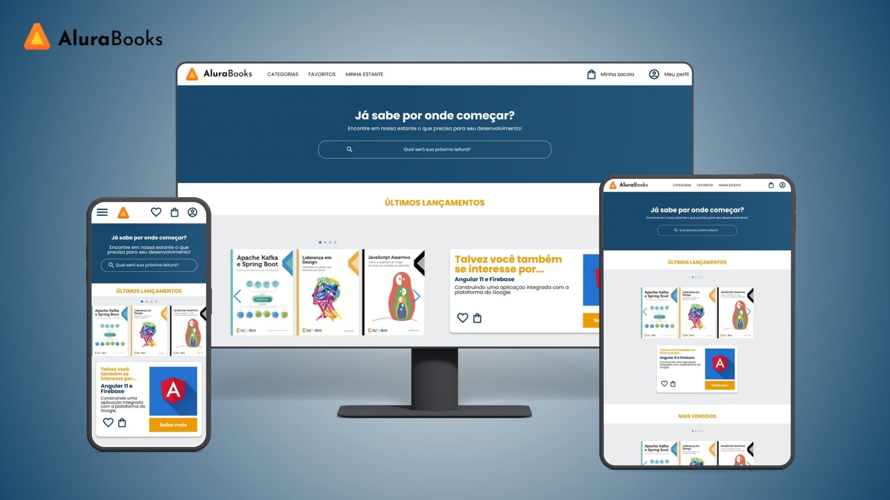
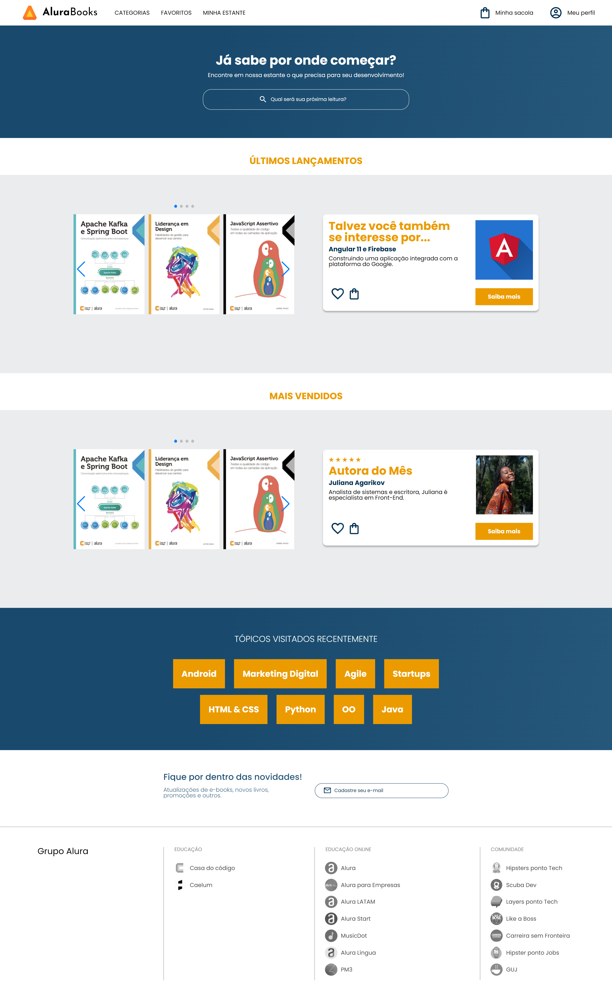

<h1 align="center">Projeto - Alura Books 📚</h1>

 Este é um projeto desenvolvido durante a formação da Alura <a href="https://cursos.alura.com.br/degree/certificate/2e85c664-e5e4-450f-9994-074e43c763e0?lang=pt_BR">A partir do Zero: HTML e CSS para Projetos Web.</a> 
Possui um navbar resposivo, com uma lista de categorias e menu hamburguer que foi feito sem precisar utilizar JS. Além disso, foi apresentado durante as aulas a biblioteca Swiper JS para a implentação de carrosséis de imagens. Tudo isso com foco em responsividade. 

 
 

  

    <h3>Página completa do projeto</h3> 
    

 

## 🚀 Tecnologias
* HTML e CSS
* SwiperJs
* Flexbox
 

## 💻 Projeto
Para visualizar a última vesão do projeto clique abaixo:
 
 
Visite o [projeto](https://alura-books-six-nu.vercel.app/).
 
 

## 📚 Cursos Relacionados

#### HTML e CSS: Responsividade com Mobile-First
* Instrutor: Mônica Hillman
* Certificado: [Ver certificado](https://cursos.alura.com.br/certificate/418f08dc-38f7-4d20-864d-d12998b04e5e?lang=pt_BR)
 

---

Feito com muito ♥

Agradeço por visitar meu Github ♥
Me dê um "FOLLOW" que retribuo, vamos criar novas conexões 😊

Até a próxima! 👋😊
